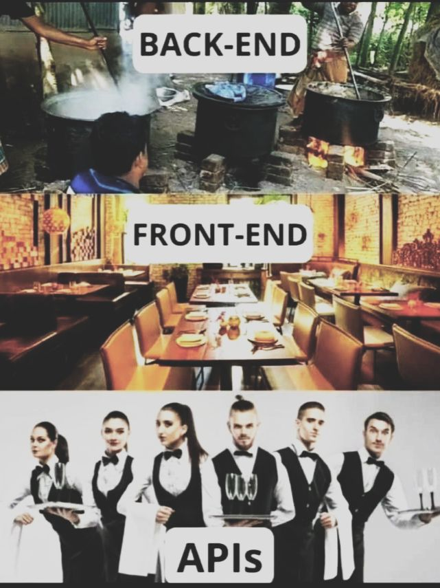
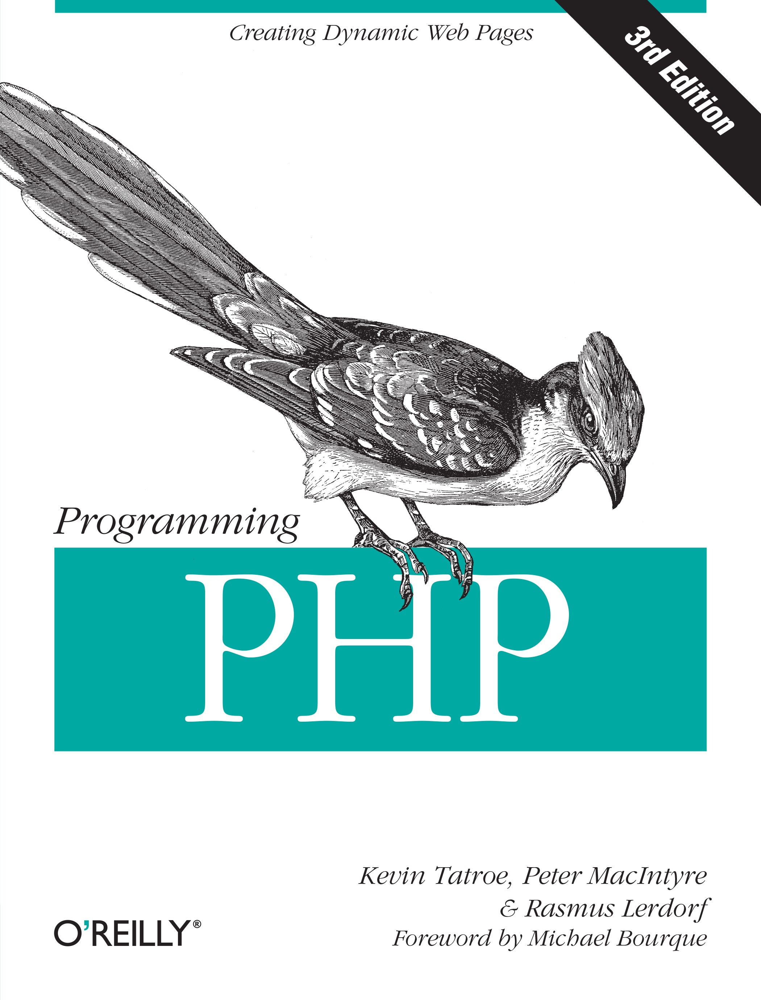

<h1 align="center">Desenvolvimento Web Back-end</h1>

<h3 align="center">Prof. Eduardo Ono</h3>

<h5 align="center">Atualizado em: 15/04/2024</h5>

&nbsp;

&nbsp;

## Descrição

> Fundamentos do Desenvolvimento Web Back-end. Implementação de código utilizando várias linguagens de programação e suas "stacks" correlatas.

&nbsp;

## Sumário

* ### [Conteúdo](./conteudo/)

* ### [Imersões](./imersoes/)

* ### [Projetos](./projetos/)

&nbsp;

## Conteúdo Programático

| Aula | Data | Tópico |
| :-:  | :-:  | --- |
| 01 |  | Introdução ao Desenvolvimento Back-end |
| 02 |  | Programação em PHP |
| 03 |  | Banco de Dados; Integração com o PHP |
| 04 |  | Node.js |
| 05 |  | REST APIs |
| 06 |  | DevOps: Containers, Docker e Kubernets |
| 07 |  | Cloud Web Services |
| 08 |  | Python, Django, Flask |

&nbsp;

## Recursos

* <https://www.w3schools.com>
* <https://www.php.net/manual/pt_BR/>

&nbsp;

## Bibliografia Básica

| Capa | Descrição |
| ---  | --- |
|  | [ROBBINS-5e_2018] ROBBINS, Jennifer N.; __Learning Web Design - A Beginner's Guide to HTML, CSS, JavaScript, and Web Graphics, 5. ed.__, 2018[.](https://app.box.com/s/thfya26nnxo8gwbwo09qjfwq83n96m4a) |
|  | [FLANAGAN-6e_2013] FLANAGAN, David; __JavaScript - O Guia Definitivo, 6. ed.__, Porto Alegre : Bookman, 2013[.](https://app.box.com/s/1nud9latis2zqn63f3ycsj0nv7zlv1mr) |
|  | [FLANAGAN-7e_2020] FLANAGAN, David; __JavaScript - The Definitive Guide, 7. ed.__, O’Reilly Media, 2020. |
|  | [TATROE-3e_2013] TATROE, Kevin; MacINTYRE, Peter; LERDORF, Rasmus. [__Programming PHP, 3 ed.__](https://archive.org/details/ProgrammingPHP3rdEdition), 2013. |

&nbsp;

## Bibliografia Complementar

| Capa | Descrição |
| ---  | ---       |
|  | [CHACON_2014] CHACON, Scott; STRAUB, Ben; [__Pro Git, 2. ed.__](https://git-scm.com/book/en/v2), Apress, 2014. |
|  | [Git Notes for Professionals](https://goalkicker.com/GitBook/) |
|  | [HAVERBEKE-3e_2018] HAVERBEKE, Marijn. [__Eloquent JavaScript, 3. ed.__](https://archive.org/details/2018eloquentjavascript), 2018. |
|  | [GRONER-2e_2018] GRONER, Loiane; __Estruturas de Dados e Algoritmos em JavaScript__, São Paulo : Novatec, 2018[.](https://app.box.com/s/ad9284w4gaxfyi3s6jtngy9i2wjnnx2k) |
|  | [BUNA_2016] BUNA, Samer. [__React.js Succinctly__](https://www.syncfusion.com/ebooks/reactjs_succinctly), 2016. |

&nbsp;

## Filmes e Documentários Recomendados

| Thumb | Descrição |
| :-: | --- |
|  | [FRONTLINE PBS \| Official] [__Amazon Empire: The Rise and Reign of Jeff Bezos (full film) \| FRONTLINE__](https://www.youtube.com/watch?v=RVVfJVj5z8s)   (1:53:16, YouTube, Fev/2020) |

&nbsp;
