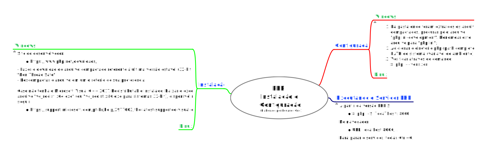

## Desenvolvimento Web (Back-End) / Conteúdo / Ambiente de Desenvolvimento

Prof. Eduardo Ono

Home Page: https://eduardo-ono.github.io/desenvolvimento-web_back-end/conteudo/

 

### Instalação e Configuração de Softwares
 

### PHP
 

* [TekZoom] [PHP Instalado e RODANDO com SERVIDOR Embutido](https://www.youtube.com/watch?v=HzIXZVctwI8) (11:01)

 

### Material de Apoio
 

* https://www.w3schools.com
