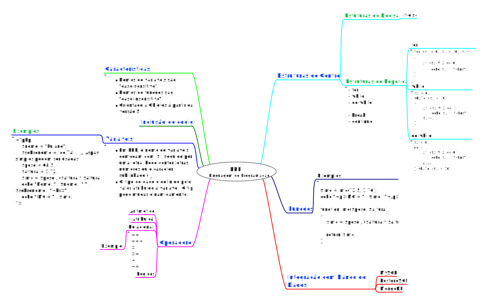

## Desenvolvimento Web (Back-End) / Conteúdo / PHP

Prof. Eduardo Ono

Home Page: https://eduardo-ono.github.io/desenvolvimento-web_back-end/conteudo/php/

<br>

### Fundamentos
<br>



<br>

### Material de Apoio
<br>

* http://www.newthinktank.com/2019/12/learn-php-one-video/
* [Derek Banas] [PHP Tutorial 2020](https://www.youtube.com/watch?v=NihZYkNpslE) (2:17:05)

    ```
    Table of Contents
    - 0:00:45 Intro | 0:01:35 Variables | 0:01:55 Data Types
    - 0:03:56 Inline PHP
    - 0:04:16 Echo
    - 0:04:52 Forms | 0:07:00 Checking for Values | 0:07:32 Get Array | 0:08:52 How Many Values Passed
    - 0:09:14 Math Operators | 0:12:07 Math Functions | 0:13:33 Random Values
    - 0:15:13 If / Elseif / Else
    - 0:18:22 Switch
    - 0:20:35 Range
    - 0:21:32 Ternary Operator
    - 0:22:26 Identical Operator
    - 0:23:20 Printf
    - 0:24:20 String Functions
    - 0:29:13 Array Functions | 0:30:04 Foreach | 0:32:55 Multidimensional Array
    - 0:36:50 While | 0:37:40 For | 0:38:02 Continue | 0:38:34 Break | 0:39:10 Do While
    - 0:39:58 Functions | 0:42:36 Variable Number of Parameters | 0:43:37 Return Multiple Values
    - 0:44:44 Map
    - 0:45:30 Print_R
    - 0:45:45 Reduce
    - 0:47:08 Filter
    - 0:48:20 Dates
    - 0:50:38 Include Other Files
    - 0:51:24 Exception Handling
    - 0:53:18 Filter_Input
    - 0:59:21 HTMLSpecialChars
    - 0:59:59 Strip_Tags
    - 1:00:44 Setup PHPMyAdmin
        - 1:01:10 Create Database
        - 1:01:24 Create Table | 1:04:01 Insert Data | 1:04:50 Display Data | 1:07:35 Alter Table | 1:09:08 Rename Table | 1:09:36 Create DB User
    - 1:11:00 Connect to Database
        - 1:12:19 PDOStatement Objects
        - 1:15:00 Pull Data From DB
        - 1:24:41 Validate Data with Regex
        - 1:32:24 Insert Data into DB | 1:42:10 Update Data in DB | 1:47:47 Delete Data in DB
    - 1:49:48 Cookies
    - 1:52:50 Object Oriented PHP
        - 1:53:15 Class
        - 1:55:49 Static
        - 1:56:30 Object Functions
        - 1:57:10 Constructor | 1:58:10 Destructor
        - 1:58:35 Getters / Setters
        - 2:01:42 Final
        - 2:02:06 ToString
        - 2:03:25 Static Methods
        - 2:06:53 Inheritance
        - 2:07:20 Overriding Methods
        - 2:10:16 Interfaces
        - 2:13:18 Polymorphism
        - 2:15:11 InstanceOf
    ```

<br>

### Material de Apoio
- https://www.w3schools.com

<br>

### Bibliografia
<br>

* [PHP Notes for Professionals]()
